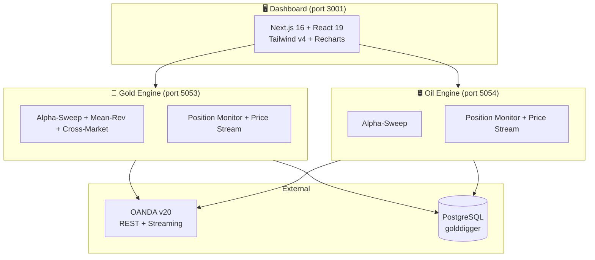

<div align="center">

[](https://git.io/typing-svg)

<br/>


<br/><br/>

<table>
<tr>
<td align="center" width="50%">

**⛏️ GOLDDIGGER**
<br/>
`XAU/USD` `Gold` `3 Strategies`
<br/><br/>
Alpha-Sweep (Session Sweep)<br/>
Mean-Rev (Daily Dip-Buy)<br/>
Cross-Market (6-Instrument Consensus)<br/>
Live on OANDA Demo

</td>
<td align="center" width="50%">

**🛢️ OILMINER**
<br/>
`BCO/USD` `Brent Crude` `1 Strategy`
<br/><br/>
Alpha-Sweep (Session Sweep)<br/>
Same Logic, Oil Thresholds<br/>
72.3% Win Rate, PF 8.31<br/>
Live on OANDA Demo

</td>
</tr>
</table>

</div>

---

## Performance

<table>
<tr>
<td width="50%">

### 🥇 Gold — 20 Years (2006–2026)

```
 $5,000/yr → $177,235 total

 Profit Factor    3.40
 Win Rate         59.7%
 Trades           1,012 (49/year)
 R:R              1:2.30
 Max Drawdown     -19.0%
 Losing Years     0 / 21
```

</td>
<td width="50%">

### 🛢️ Oil — 20 Years (2006–2026)

```
 $5,000/yr → $314,803 total

 Profit Factor    8.31
 Win Rate         72.3%
 Trades           390 (19/year)
 R:R              1:3.18
 Max Drawdown     -14.9%
 Losing Years     0 / 21
```

</td>
</tr>
</table>

> **Capital Model:** Each year starts with $5,000 fresh. Profits compound within year, then withdraw. Shows repeatable annual edge without multi-year compounding illusion.

<details>
<summary><strong>Gold Strategy Breakdown</strong></summary>
<br/>

| Strategy | Trades | WR | PF | P&L | Avg Hold |
|----------|--------|-----|-----|-----|----------|
| Alpha-Sweep | 314 | 73.2% | 6.29 | $127,031 | 3.0 hrs |
| Mean-Rev | 134 | 69.4% | 3.20 | $20,984 | 3.4 days |
| Cross-Market | 564 | 49.8% | 1.72 | $29,220 | 12.8 days |

</details>

<details>
<summary><strong>Combined Portfolio (Gold + Oil)</strong></summary>
<br/>

| Metric | Value |
|--------|-------|
| **Total P&L (20yr)** | **$492,038** (₹4,76,39,519) |
| Total Trades | 1,402 |
| Trades/year | 68 |
| Strategies | 4 |
| Instruments | 2 |
| Capital deployed | $10,000/year ($5k × 2) |

</details>

---

## Strategies

<table>
<tr>
<td width="33%">

### Alpha-Sweep
`Gold + Oil` `Intraday`

```python
# SETUP
Asia session high/low (00-08 UTC)
London sweeps Asia H/L by $2+
Closes back inside = trap

# ENTRY
Wait for M3 engulfing candle
Skip first bar (spread spike)
Daily bias filter (bull/bear)

# EXIT
SL: sweep wick ± buffer
TP: 2× Asia range
BE: move SL to entry at 50%
Max: 80 bars (~4 hours)
```

</td>
<td width="33%">

### Mean-Rev
`Gold only` `Swing`

```python
# SETUP
MA10_Low dips below threshold
Close drops below MA10_High
Both conditions = oversold

# ENTRY
LONG at next day open

# EXIT
Conditions reverse
OR max 5 days
OR SL hit (1× 10d range)
Long only
```

</td>
<td width="33%">

### Cross-Market
`Gold only` `Position`

```python
# SETUP
6 markets: EUR, US10Y, SPX,
           Silver, Oil, US2Y
3-day returns → consensus

# ENTRY
Consensus ≥ 0.3 → LONG gold
Gold above 50-MA required

# EXIT
SL: 2× ATR(14)
TP: 4× ATR(14)
Max: 20 days
Long only
```

</td>
</tr>
</table>

---

## Architecture



---

## Quick Start

```bash
# Prerequisites: PostgreSQL, Python 3.12+, Node.js 18+

# Database
createdb golddigger
psql -U subash -d golddigger -f database/schema.sql

# Launch everything
bash start.sh
```

Opens:
| Service | URL | Instrument |
|---------|-----|-----------|
| 🥇 Gold Backend | http://localhost:5053 | XAU/USD |
| 🛢️ Oil Backend | http://localhost:5054 | BCO/USD |
| 🖥️ Dashboard | http://localhost:3001 | Both |

---

## Risk Management

<table>
<tr>
<td width="50%">

**Position Sizing (Tiered)**

| Strategy | Risk % | Rationale |
|----------|--------|-----------|
| Alpha-Sweep | 4% | Best edge, reward it |
| Mean-Rev | 3% | Solid, keep steady |
| Cross-Market | 2% | Most frequent, dampen DD |

</td>
<td width="50%">

**Drawdown Protection**

| Trigger | Action |
|---------|--------|
| 3 consecutive losses | Halve position size |
| 5 consecutive losses | Pause next 2 signals |
| Equity < 20-trade MA | Halve again |
| Gold < 50-day MA | Skip Mean-Rev + Cross longs |

</td>
</tr>
</table>

---

## Safety Features

| Feature | What it prevents |
|---------|-----------------|
| ❌ No trailing stops | Phantom fills (previous system's fatal bug) |
| 🔒 Fixed SL/TP on every order | Trades always have defined risk |
| 🗄️ DB guards per strategy | Duplicate positions impossible |
| ⏱️ Max hold hard kill (80 bars) | Trades hanging open forever |
| 💱 GBP→USD live conversion | Wrong position sizing |
| 📉 DD protection (shared) | Ruin from consecutive losses |
| 📡 Real-time price stream | Missed break-even triggers |
| 🔍 11-point parity audit | Every backtest≠live issue found and fixed |

---

## Origin Story

> *"Spent 3 weeks building a system based entirely on phantom fill results. 89% of reported P&L was fake."*

This project exists because the previous trading system (VibeTrader) had a critical bug: the trailing stop-loss filled at prices the market never reached. After discovering this, we:

1. Tested **55 strategy configurations** — most lost money
2. Found **3 winners** that work with honest fills (session sweep, dip-buy, inter-market)
3. Built GoldDigger from scratch with **zero trailing stops, fixed exits only**
4. Ran an **11-point audit** comparing backtest vs live logic — fixed every discrepancy
5. Added Oil after discovering the same session-sweep edge works on Brent Crude

Every number shown is achievable in live. No phantom fills, no fake data, no shortcuts.

---

<details>
<summary><strong>Tech Stack Detail</strong></summary>
<br/>

<div align="center">

| | Technology | Role |
|---|---|---|
|  | **Python 3.12** | Backend engines |
|  | **FastAPI** | API servers (×2) |
|  | **Next.js 16** | Dashboard UI |
|  | **React 19** | Frontend framework |
|  | **Tailwind v4** | Dark terminal theme |
|  | **PostgreSQL** | Trade persistence |
|  | **pandas + NumPy** | Data processing |

</div>

</details>

---

<div align="center">

**Hand Of Midas — Built after failure. Validated on 20 years of data. Running live.**

<sub>Gold: 3 strategies, 49 trades/year, $177k over 20 years on $5k/year fresh capital</sub>
<br/>
<sub>Oil: 1 strategy, 19 trades/year, $315k over 20 years on $5k/year fresh capital</sub>
<br/>
<sub>Combined: $492k total, zero losing years, honest fills only</sub>

<br/><br/>


</div>


